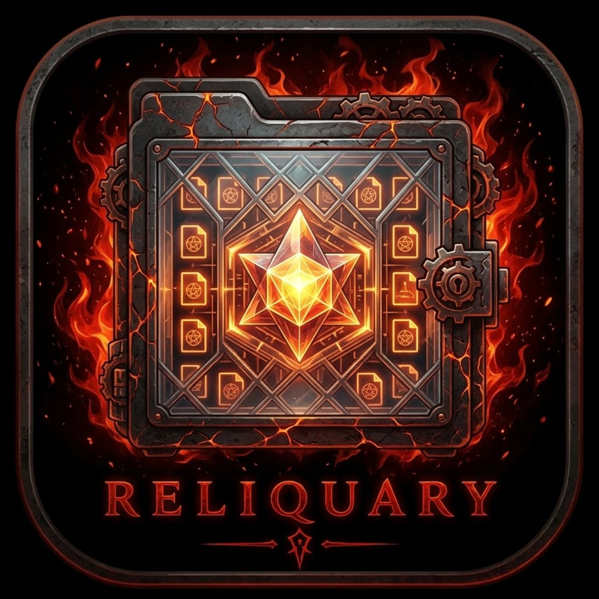

<p align="center">
  
</p>

<h1 align="center">🔥 Reliquary</h1>

<p align="center">
  <strong>The default GUI file manager for Lilith Linux</strong><br>
  <sub>Built on <a href="https://github.com/visnkmr/filedime">filedime</a> · Tauri + Next.js · Lilim AI</sub>
</p>

<p align="center">
  <a href="https://github.com/BlancoBAM/Reliquary/releases/latest">
    
  </a>
  <a href="https://github.com/BlancoBAM/Reliquary/actions/workflows/build.yml">
    
  </a>
  <a href="LICENSE">
    
  </a>
  
  
</p>

---

## ✨ Features

| Feature | Description |
|---|---|
| **Drag & Drop** | Drag any file or folder onto a directory to move it instantly |
| **Copy / Cut / Paste** | `Ctrl+C` / `Ctrl+X` / `Ctrl+V` — full clipboard file ops with conflict resolution |
| **Rename** | Right-click → **Rename** inline |
| **Delete / Trash** | Right-click → **Move to Trash** (XDG) or **Delete Permanently** |
| **Undo** | `Ctrl+Z` undoes the last move, copy, rename or create |
| **Tabs & Multi-window** | Unlimited tabs, independent windows |
| **Bookmarks** | Persistent sidebar shortcuts |
| **Drive Listing** | Auto-detect and browse mounted drives |
| **File Preview** | Inline preview of text, images, video, PDF and Office files |
| **Fuzzy Search** | Full-path search with indexed search lists |
| **Lilim AI** | Ask questions about file contents via [Lilim](https://github.com/BlancoBAM/Lilim) |
| **Miller Columns** | Alternative column-based navigation |
| **Dual Viewer** | Side-by-side file comparison |
| **Infernal Dark Theme** | Lilith Linux black + crimson flame palette — always on |

---

## 🎨 Theme

Reliquary uses the **Lilith Linux Infernal Dark** palette:

| Token | Value |
|---|---|
| Background | `#0a0a0a` |
| Surface | `#111111` / `#1a1a1a` |
| Primary accent | `#c0392b` — crimson flame |
| Secondary accent | `#ff6b35` — ember orange |
| Typography | Inter · Rajdhani |

---

## 🤖 Lilim AI Integration

Reliquary connects to [Lilim](https://github.com/BlancoBAM/Lilim) — or any Ollama-compatible inference server — for:

- **File embedding** — index file contents as vectors
- **Semantic search** — natural-language queries across indexed files
- **File chat** — ask questions about a specific document

Configure the endpoint in **Settings → Lilim / LLM server URL** (default: `http://127.0.0.1:11434`).

---

## 📦 Installing on Lilith Linux

Download the `.deb` package from the **[Releases page](https://github.com/BlancoBAM/Reliquary/releases/latest)** and install:

```bash
sudo dpkg -i reliquary_*.deb
# or
sudo apt install ./reliquary_*.deb
```

Set as the default file manager:

```bash
xdg-mime default reliquary.desktop inode/directory
xdg-mime default reliquary.desktop application/x-gnome-saved-search
```

---

## 🚀 Building from Source

### Prerequisites

```bash
# Ubuntu 22.04 / Lilith Linux
sudo apt install \
  libwebkit2gtk-4.0-dev build-essential libssl-dev libgtk-3-dev \
  libayatana-appindicator3-dev librsvg2-dev libsoup2.4-dev
# Node 20+, Rust stable
```

### Development

```bash
npm install
npm run tauri dev   # Next.js hot-reload + Tauri window
```

### Release .deb

```bash
npm run build       # export Next.js to out/
npm run tauri -- build --bundles deb
# → src-tauri/target/release/bundle/deb/reliquary_*.deb
```

---

## ⌨️ Keyboard Shortcuts

| Shortcut | Action |
|---|---|
| `Ctrl+Z` | Undo last file operation |
| `Delete` | Move selection to Trash |
| `Shift+Delete` | Permanently delete selection |
| `Ctrl+C` | Copy |
| `Ctrl+X` | Cut |
| `Ctrl+V` | Paste into current folder |
| `Ctrl+T` | New tab |
| `Ctrl+N` | New window |
| `Ctrl+W` | Close tab |
| `Ctrl+H` | Toggle hidden files |
| `Ctrl+D` | Bookmark current path |
| `Alt+←` | Back |
| `Alt+→` | Forward |
| `Alt+↑` | Parent directory |
| `F5` | Refresh |

---

## 🙏 Credits

- [filedime](https://github.com/visnkmr/filedime) by **visnkmr** — MIT License
- Reliquary fork & Lilith Linux integration by **[BlancoBAM](https://github.com/BlancoBAM)**